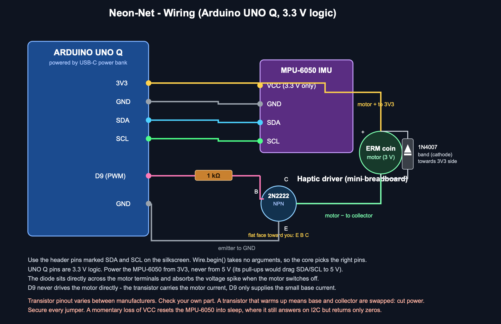

# Neon-Net

**A real aquarium fish net that catches AR jellyfish, with the game's AI running
on the net itself.**

> **HERO VIDEO:** 60 to 90 seconds. First-person capture through the Spectacles,
> intercut with a third-person shot of the net being swung in the same room. End
> on the result screen.

> **HERO PHOTO:** the finished net on a plain background, whole thing in frame,
> so the electronics on the handle are visible.

---

## Where this came from

Jellyfishing.

If you grew up watching a certain cartoon sponge, you know exactly what that
word means: two friends, two nets, a field full of jellyfish, and an afternoon
spent chasing them. I have wanted to actually do it since I was a child. Not a
game about it. Do it. Hold the net, swing it, catch one.

That is the whole brief, and everything else in this project follows from it.

It explains the prop, because jellyfishing is done with a net and nothing else.
It explains the quarry. And it explains why the net had to buzz in my hand:
jellyfish in the cartoon **sting**, and a net that gave no physical answer would
have missed the point entirely. The moment of contact has to arrive through your
hand, not just your eyes.

So: put on a pair of Snap Spectacles and your room fills with a shoal of
bioluminescent jellyfish. Pick up a real aquarium fish net, the small mesh kind
you use to scoop a fish out of a tank. Swing it through one, and you catch it,
and you feel it.

The prop does a lot of work before anyone explains anything. Hand somebody a net
and point at a jellyfish and there is nothing left to teach.

The interesting part, and the reason this is an Arduino UNO Q project rather
than a Lens Studio project, is that the net is not a dumb button. It samples its
own motion two hundred times a second, predicts where the swing is going before
it gets there, and decides how hard the game should be for the person holding
it. All of that happens on the net. Nothing is sent to the cloud.

*Inspired by, and unaffiliated with, the cartoon that put the idea there. No
characters, artwork or audio from it appear anywhere in this project. The
jellyfish here are my own design: deep-sea bioluminescent rather than cartoon
yellow.*

---

## What it is like to play

You stand in the middle of a room. Fourteen jellyfish drift around you, in three
kinds, in three colours: common cyan Drifters, jumpier violet Skittish ones, and
rare gold Lumens worth triple. They are in two loose shoals, and they hang at
all sorts of angles, some upright, some lolling over on their sides.

They notice you. Come too close and one will freeze for a beat and then dart
away, and a creature that has noticed you cannot be caught, so being seen is a
real escape.

**How hard you swing is the decision the game turns on.** A gentle scoop has a
short reach but disturbs almost nothing, so you can work your way into a cluster
and take them one at a time. A committed lunge reaches twice as far, but it is
loud: everything nearby wakes up, and if you miss you have just made the whole
cluster untouchable for a couple of seconds.

The shoal has a mood. Land three catches quickly and it panics, groups tight,
and backs away from you. Miss twice and it becomes curious instead, disperses,
and drifts in closer to investigate. The mood shows on the display as a small
face: `^_^` calm, `o_o` curious, `>_<` spooked.

Catches chain. Take another within four seconds and the multiplier climbs, up to
four times, with the window draining away on the score line so you can see how
long you have. And for the last fifteen seconds of the sixty second round the
shoal blooms: six more jellyfish arrive and everything is worth double. The
round has a shape rather than just stopping.

> **PHOTO:** first-person capture mid-round, with a jellyfish close and the HUD
> readouts visible.

> **PHOTO:** the shoal seen across the room, showing creatures occluded by real
> furniture.

---

## The circuit



Two subsystems on one board. The MPU-6050 is an I2C device on 3V3, and **only**
3V3: its pull-ups would drag SDA and SCL to 5 V otherwise. The haptic motor is
switched rather than driven, because an ERM draws far more at stall than a pin
can source and is an inductive load, so pin D9 feeds a 1 kΩ resistor into a
2N2222's base while the motor sits in the collector path.

The 1N4007 across the motor is not optional. Without it the motor's collapsing
field spikes the rail when it switches off, and on this build that spike browns
out the MPU-6050 into sleep, where it still answers on I2C and returns nothing
but zeros. That failure cost an evening before the cause was found.

## How it works

The Arduino UNO Q carries two processors, and the split between them is the
whole architecture. It is not a matter of taste; it is a latency budget.

```
  ┌─────────────────────────── Arduino UNO Q ───────────────────────────┐
  │                                                                     │
  │   STM32U585 (Zephyr)                 Qualcomm QRB2210 (Debian)      │
  │   ─────────────────────               ─────────────────────────      │
  │   MPU-6050 at ~200 Hz                 Trajectory + difficulty AI     │
  │   swing detection                     WebSocket server  :8765        │
  │   haptic pattern timing   ◄──RPC──►   game dashboard    :8080        │
  │                                       per-player sessions            │
  └─────────────────────────────────────────────┬───────────────────────┘
                                                │  WebSocket, local network
                                                ▼
                                    Snap Spectacles (2024)
                                    creatures, HUD, spatial audio
```

Anything that cannot tolerate jitter stays on the microcontroller. Reading the
IMU at 200 Hz and timing a vibration pattern to the millisecond are both jobs
where a scheduler hiccup is audible in your hand, so they run bare-metal on the
STM32 side under Zephyr.

Everything that benefits from a real operating system lives on the Qualcomm
side, under Debian: the two AI models, a WebSocket server, an HTTP dashboard,
and per-player session state. `Arduino_RouterBridge` carries remote procedure
calls between the two halves, so the Linux side can ask the microcontroller for
a window of IMU samples or tell it to play haptic pattern three.

This is what the UNO Q is for. On a conventional microcontroller the AI would
have to be cut down to fit; on a single-board computer the haptics would have
jitter you could feel.

---

## The AI, and where it runs

Both models run on the board, in plain Python, against the standard library
only. Both are heuristic by design. They are cheap enough for the poll loop,
and unlike a trained network their behaviour is inspectable and repeatable,
which matters a great deal when the whole thing has to survive being filmed in
one take.

### Predictive Trajectory AI

The problem: there is a wireless round trip between the net and the glasses. If
the glasses only learn about a swing once it has peaked, the catch feels late.

The model takes three smoothed acceleration samples, fits a parabola through
them, and solves for the vertex, which is the peak of the swing. If that vertex
falls inside a 100 ms horizon, the swing is announced **before it happens**, and
the glasses start reacting while the net is still moving.

A parabola rather than plain Newtonian extrapolation, and for a concrete reason:
a swing decelerates as it approaches its peak, so projecting the current slope
forward at constant acceleration puts the peak roughly twice as far ahead as it
really is. Fitting a curve through three points picks the turning point up
directly.

Measured lead on real swings: **35 to 84 ms** ahead of the peak, with a
confidence figure that falls off as the forecast reaches further ahead.

### Adaptive Difficulty AI

The problem: a fixed difficulty is wrong for almost everybody.

The model watches the catch-to-swing ratio over a sliding window of ten swings
and moves a single difficulty value to hold the player near a 55 per cent catch
rate. The Lens receives derived multipliers rather than the raw number, so all
the balancing lives on the board and the Lens simply obeys: creature speed, how
far they dodge, how early they notice you, and how skittish they are.

Past a threshold the rare gold creatures begin **cloaking**, fading towards
invisibility. On an additive display that means they genuinely disappear rather
than turning grey, so it reads as deliberate camouflage.

### Making the AI visible

A claim in a write-up is worth very little. Both models put themselves on screen
while you play: a flash reading `SENSED 84ms` each time the trajectory model
fires, and a live `SHOAL ALERTNESS` percentage which is the difficulty value
made legible.

---

## App Lab: the dashboard and multiplayer

The Qualcomm side also serves a dashboard on port 8080, which anyone on the
network can open in a browser while somebody else plays.

It exists because of a blunt piece of playtest feedback. The first version was a
grid of unlabelled numbers, and the verdict was *'what is the use of dashboard i
dont understand'*. Fair. It was rewritten around three questions instead: who is
playing, how well, and what the AI decided about it.

Players are now the top of the page, one card each, sorted by score. Each card
shows their catch rate and a difficulty meter labelled in words, *Gentle, Easy,
Balanced, Hard, Brutal*, with a sentence underneath saying what the model just
did and why: *'Catching more than 55% of swings, so the shoal was sped up and
made harder to sneak up on.'* Those thresholds are read off the live model and
sent with the state, so the explanation cannot drift away from what the AI is
actually doing.

**Multiplayer is real rather than decorative.** Every pair of Spectacles that
connects becomes a session with **its own** difficulty model, so two players of
different skill can share one room and each get a fair game. Results and
difficulty updates are addressed per socket, never broadcast.

> **PHOTO:** the dashboard open on a laptop beside the gameplay, with two
> sessions listed and different difficulty levels.

### Zero dependencies, on purpose

There is nothing to `pip install`. The WebSocket server is raw sockets and a
hand-written RFC 6455 implementation: handshake, masked inbound frames,
unmasked outbound frames. The dashboard is `http.server`. Both sounds are
synthesised by a standard-library script.

App Lab runs the app in a container where package installation is awkward, and
'nothing to install' is worth more on the day than any convenience a library
would have bought.

---

## The build, and five things that went wrong

The debugging is the most useful part of this write-up, because every one of
these will happen to the next person who builds on an UNO Q.

**1. `Serial` prints nothing.** Including `Arduino_RouterBridge.h` replaces
`Serial` with `Monitor`. The sketch ran perfectly and said nothing at all. It
also needs a `delay(3000)` after `Monitor.begin()` before the first print
survives.

**2. `Bridge.begin()` after `Monitor.begin()` silently kills all printing.**
They share a transport, and initialising Bridge second resets it. Printing
worked in early phases and stopped in a later one with no error, no warning and
no clue. Initialise Bridge first.

**3. `ports: []` in `app.yaml` means the container never publishes.** The
server was running correctly, SSH worked, and every connection to port 8765 was
refused. Nothing logs an error for this. It needs `ports: [8765, 8080]` and a
full redeploy.

**4. A brownout resets the MPU-6050 into sleep, where it still answers.** The
IMU returned nothing but zeros after a hard swing. Not a dead sensor: it still
acknowledged on I2C and still reported the right `WHO_AM_I`, it was simply
asleep and reporting zeros. The motor's inductive kick was browning out the
rail. The fix is the flyback diode across the motor plus a watchdog that
re-initialises the IMU if readings flatline. The boot sequence now buzzes a
diagnostic code: one long buzz is healthy, two short means no I2C acknowledge,
three short means asleep.

**5. An imported animation that was not playing, while every check said it
was.** The jellyfish model looked completely static. Two separate measurements
reported the skeleton was animating, and both were wrong: one was measuring the
creature's own yaw spin, the other was reading a bone inside the bell rather
than the body axis. The cause turned out to be the importer. Lens Studio brought
the 4.125 second glTF animation in with `clip.end = 0.1375`, which is exactly
4.125 divided by 30: it had read the glTF's keyframe times, which the format
specifies in seconds, as frames, then divided by 30 fps. The player was
faithfully looping a 137 millisecond sliver of a four second swim cycle.
Repairing `clip.end` in script fixed it. **If an imported animation looks frozen
in Lens Studio, print `clip.end` before touching anything else.**

> **PHOTO:** the soldered IMU close up, and the transistor circuit on the
> breadboard.

> **PHOTO:** the net mid-assembly, before the electronics were taped down.

---

## Two things that were deleted, and why

Cutting features turned out to matter as much as adding them.

**The sense strand.** An arc of eleven glowing motes low in the view, built at
runtime from the creature prefab so it was made of the same light as the
jellyfish. Its colour was the shoal's mood, its glow length was the difficulty,
and a wave ran along it whenever the board predicted a swing. It was the
prettiest thing in the project.

It was cut, because one element carrying three meanings could not be read in
play. The playtest question was *'the ui at the bottom that changes colour blue
orange etc whats that for?'*, and 'what is that for?' is a fatal question for a
HUD element that no amount of polish answers. Its three jobs became three
labelled readouts, and then the strand itself was redundant.

**A whispered mood line**, which said the same thing as the mood face two lines
above it.

The lesson, learned twice: **verify the thing the player can see, not the thing
the code claims.** 'The AnimationPlayer exists, autoplay is true, and the clip
is looping' was entirely true and entirely useless.

---

## Honest scope

- The firmware computes **acceleration magnitude**, not velocity or orientation. Magnitude is what the swing detector and the trajectory model consume. The MPU-6050's gyro is present and unused.
- Communication between the processors uses the **Router Bridge RPC directly**, which is the mechanism underneath App Lab's higher-level bricks.
- The AI is **heuristic, not learned**. That is a deliberate choice for repeatability under filming, not a limitation worked around.
- Filming safeguards are built in on purpose: a leash so nothing escapes across the room, a mercy window after repeated misses, and a guarantee that one easy target is always within reach. They can all be switched off.

---

## Build it yourself

- **[`BOM.md`](BOM.md)** — every component, with why each one is there
- **[`wiring-diagram.svg`](wiring-diagram.svg)** — the schematic
- **[`LumiCatch-Build-Guide.md`](LumiCatch-Build-Guide.md)** — the full build log, phase by phase, including every failure above written up properly
- **[`README.md`](README.md)** — repository layout and quick start

No hardware yet? `mock-net.py` impersonates the entire board, including both
real AI models, and serves the same dashboard, so the Lens can be developed on a
laptop alone.

---

## What is next

- **The sting.** The one thing from the original that is not in here yet. Mishandle a rare one, or lunge into a spooked shoal, and the net should bite back: a sharp haptic jolt and a score penalty. The motor and the four-pattern haptic engine are already in place, so this is a gameplay decision rather than a hardware one.
- Use the gyro for orientation, so the net's attitude affects the catch and not just its acceleration
- Two players in one room on camera, which the board already supports and the video has yet to show
- Creatures that hide behind real furniture deliberately, using the world mesh that already occludes them
